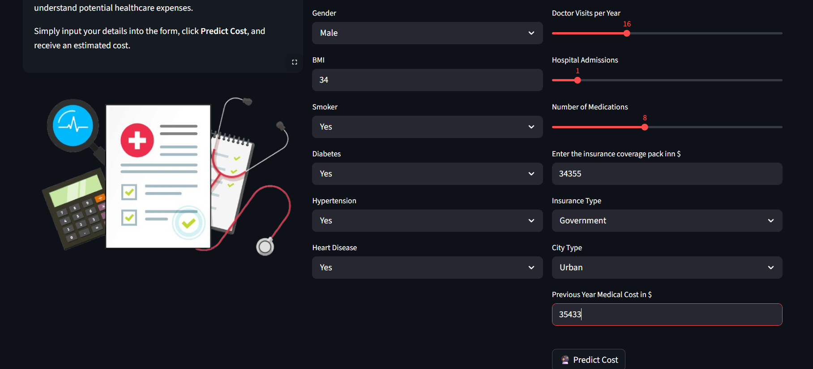
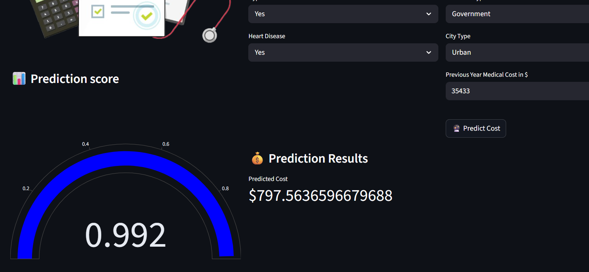

# Medical-Cost-Prediction-webapp
 MEDCAL is your intuitive tool for predicting medical costs based on key         demographic and health indicators. Leveraging advanced machine learning         models, we provide estimates to help you understand potential healthcare         expenses.
This is a demo of my project.

